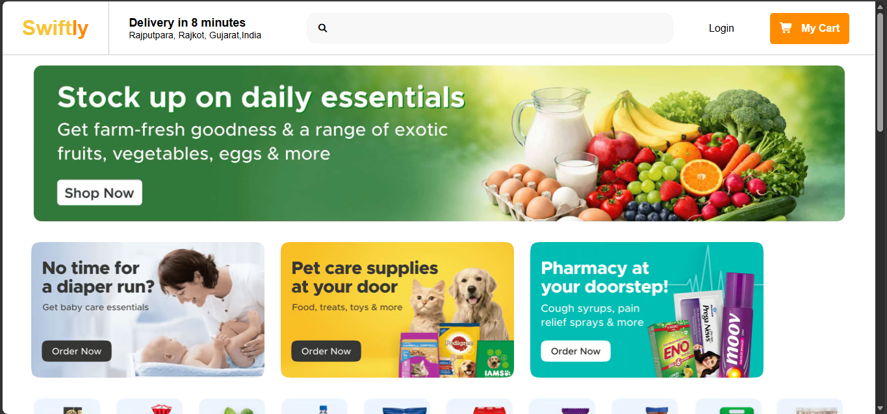
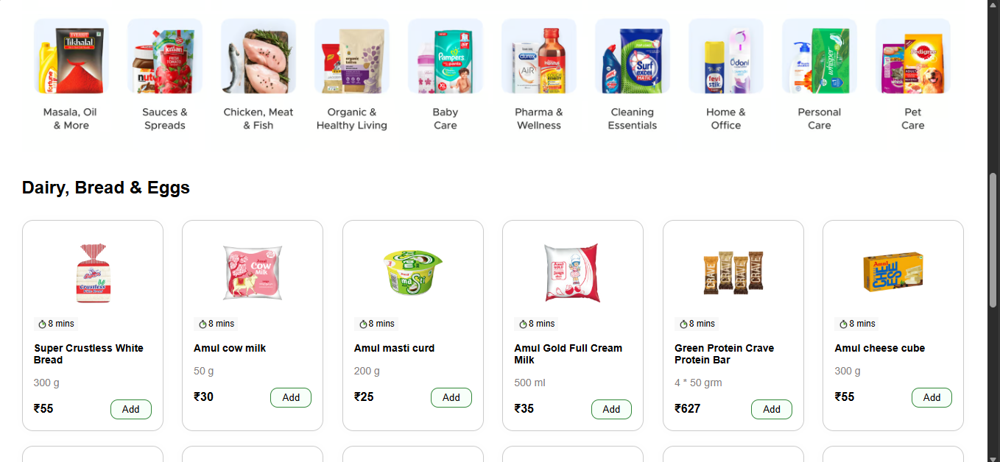
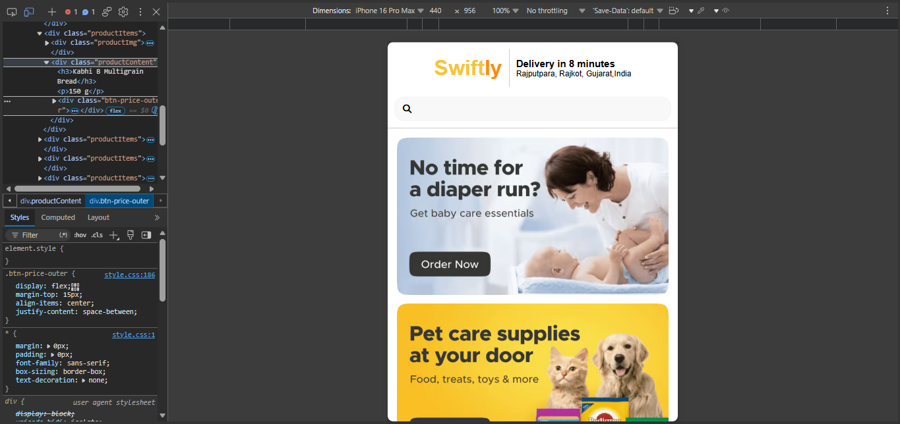

# 🛒 Swiftly — Quick Commerce UI

A responsive quick-commerce website UI built using HTML and CSS.

This project focuses on recreating a modern grocery delivery experience with responsive layouts for desktop and mobile devices.

## 📸 Project Preview

### Desktop Homepage



### Product Section



### Mobile Responsive Design



## ✨ Features

- Responsive navigation header
- Hero banner section
- Promotional banners
- Product categories
- Product cards
- Product pricing and Add buttons
- Responsive product grid
- Responsive footer
- Useful links section
- Categories section
- Mobile-friendly layout
- Desktop and mobile responsive design

## 🛠️ Technologies Used

- HTML5
- CSS3
- Flexbox
- Responsive Design
- Media Queries
- Font Awesome

## 📱 Responsive Design

The website is designed to work across different screen sizes.

### Desktop

- Multi-column product layout
- Full navigation header
- Large promotional banners
- Multi-column footer

### Mobile

- Responsive header
- Mobile navigation
- Two-column product layout
- Responsive category layout
- Two-column footer categories
- Mobile-friendly footer

## 📂 Project Structure

```text
01-quick-commerce-ui/
│
├── home.html
├── style.css
├── media.css
├── assets/
│   └── images/
├── screenshots/
│   ├── desktop-home.png
│   ├── products.png
│   └── mobile-responsive.png
└── README.md
```
